### Hi there 👋

I'm **AlasDiablo** (or **lIotaMiu**), and I'm a French software engineering.

#### 🔭 I'm currently working on Minecraft Mods, JavaScript libraries, Web Services and more!

#### 💬 Ask me about anything

#### 📫 How to reach me: You can reach me via my Minecraft Modding [Discord](https://discord.gg/KkzqnzA)

#### 😄 Pronouns: It doesn't matter, I have two pseudonyms, one is male (AlasDiablo) and the other is female (lIotaMiu).

### Take a look at what I've created and contributed:

#### My importants Own creations:

    
    
    
    

#### My contributions:

    
    
    
    
    

### 🔥 Statistics

    

<!--
**AlasDiablo/AlasDiablo** is a ✨ _special_ ✨ repository because its `README.md` (this file) appears on your GitHub profile.

Here are some ideas to get you started:

- 🔭 I’m currently working on ...
- 🌱 I’m currently learning ...
- 👯 I’m looking to collaborate on ...
- 🤔 I’m looking for help with ...
- 💬 Ask me about ...
- 📫 How to reach me: ...
- 😄 Pronouns: ...
- ⚡ Fun fact: ...
-->
